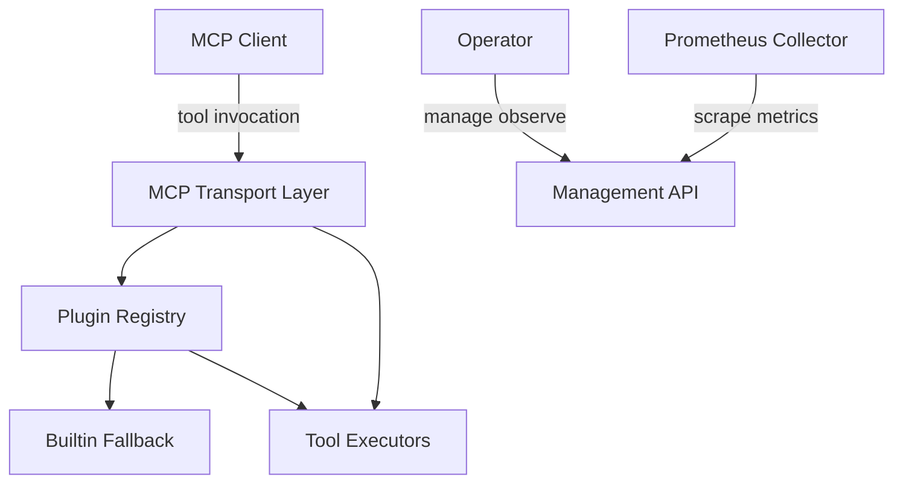
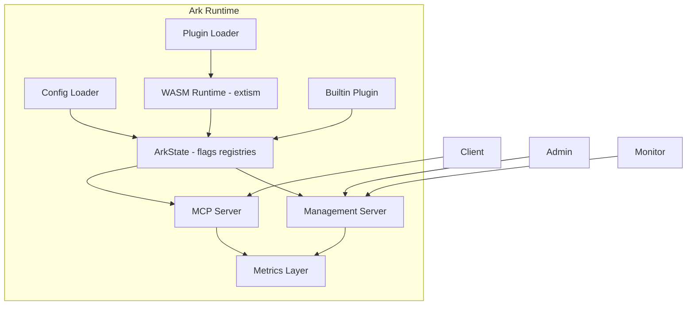
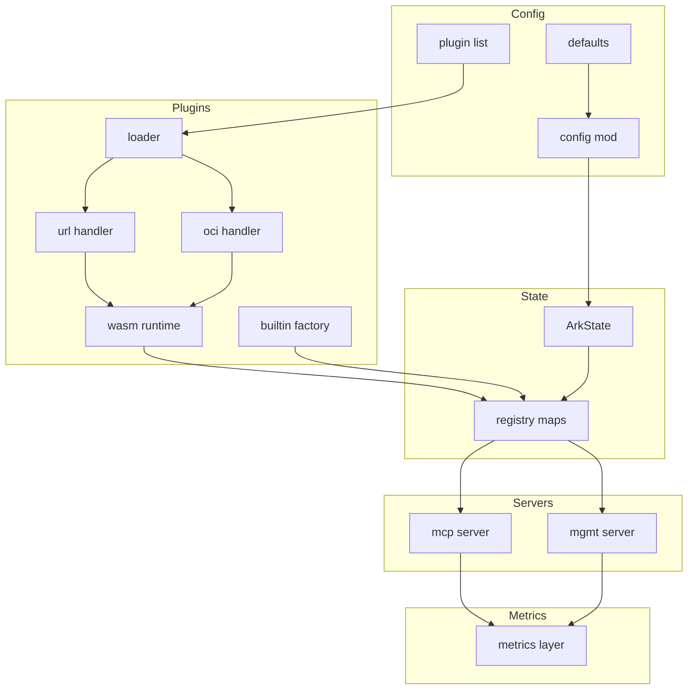
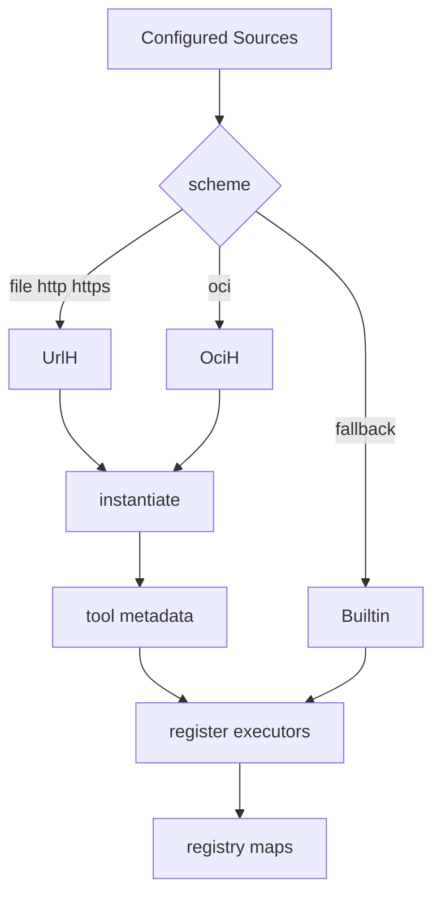
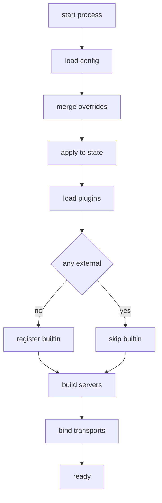
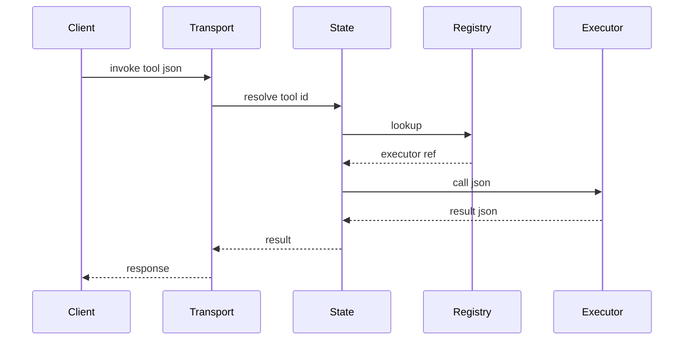
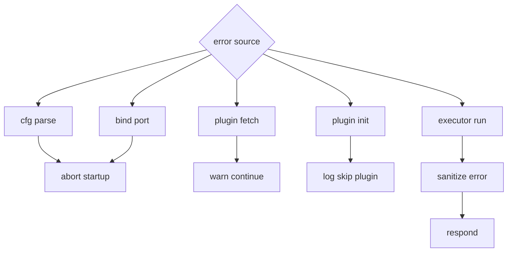
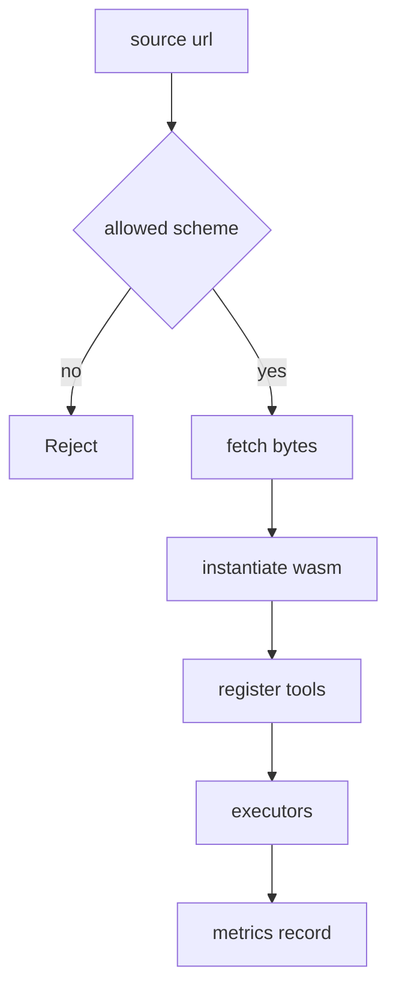
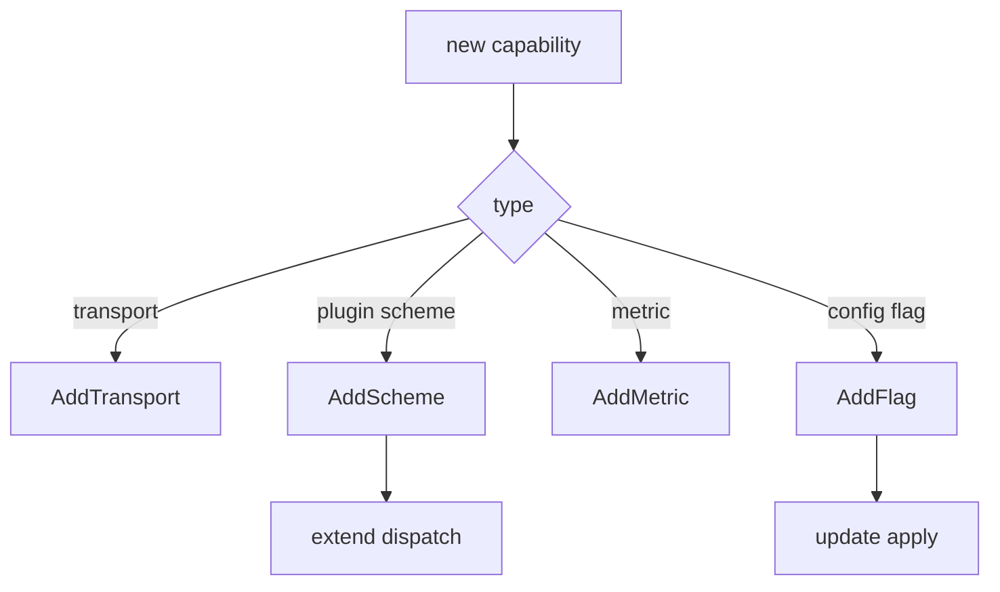
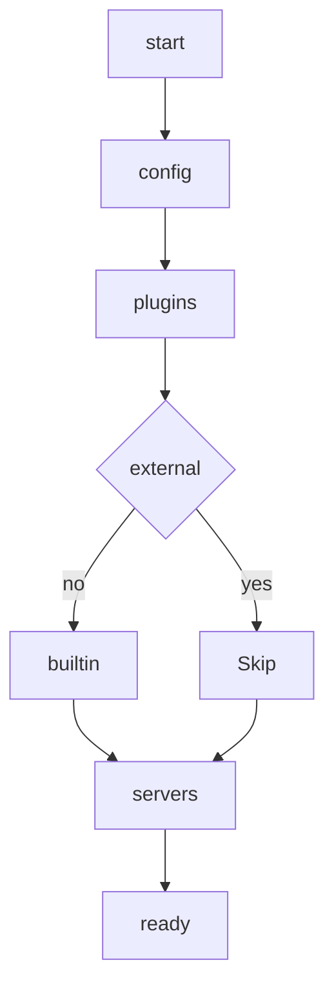

<!-- Regenerated architecture document (clean single version, no C4). -->

# 1. Overview
This document describes the Ark MCP server: a modular monolithic runtime that loads external or builtin plugins, exposes their tools over multiple transports, and conditionally serves management and metrics surfaces. Emphasis is on predictable configuration layering, safe plugin isolation, graceful degradation, and minimal per‑request branching.

Core goals:
- Deterministic config precedence (CLI > env > YAML > defaults)
- Optional surfaces compiled out entirely via feature flags
- Clear registries separating discovery from execution
- Fail fast on invalid configuration; soft fail on individual plugin issues

Technology stack: Rust (Tokio async), Axum HTTP, extism WASM runtime, optional Prometheus / OTEL metrics, simple in‑memory registries.

# 2. System Context
The system sits between MCP clients and plugin tool executors, optionally fronted by a management HTTP API and observed by metrics scrapers.


# 3. Container View
High level runtime groupings highlight separation of config ingestion, plugin resolution, serving layers and observability.


# 4. Module Breakdown
Core source modules and their relationships; arrows show primary dependency or runtime data flow.


## Plugin Subsystem Detail
Breakdown of the plugin resolution pipeline from configured sources to executor registration.


# 5. Data Flow
This section illustrates lifecycle (startup to ready) and request execution paths.
## Startup Sequence

## Tool Invocation


# 6. Error Handling Strategy
Error handling favors early termination for invalid configuration while allowing partial success for plugin loading. All executor errors are sanitized at response boundaries.


# 7. Security Considerations
Security centers on WASM sandboxing, controlled source schemes, optional insecure HTTP fetch, and future integrity enforcement (signatures, digests, resource quotas).


# 8. Extensibility & Modularity
Adding new capability follows a repeatable pattern: model config, implement logic, expose surfaces, instrument metrics, update docs/diagrams, review security.


# 9. Glossary
| Term           | Definition                                      |
| -------------- | ----------------------------------------------- |
| ArkState       | Shared runtime structure (flags, registry maps) |
| Registry       | Map of tool id to executor and metadata         |
| Executor       | Closure or future performing tool logic         |
| Builtin Plugin | Fallback toolset when no external plugins load  |
| Transport      | Stdio or HTTP based conduit for MCP exchanges   |
| Feature Flag   | Cargo feature toggling optional surfaces        |
| Tool           | Named callable with JSON input and output       |

# 10. Appendix
Supplementary flows and quick start guidance; omit if redundant with earlier diagrams.
## Quick Start
1. Provide config (optional). 2. Run binary with features. 3. Check readiness. 4. Invoke tools.
## Lifecycle (Condensed)


---
End of architecture document.
    Dispatch -->|oci| OciH
    UrlH --> WasmInit[instantiate]
    OciH --> WasmInit
    WasmInit --> Extract[tool metadata]
    Extract --> Register[register executors]
    Dispatch -->|fallback| Builtin
    Builtin --> Register
    Register --> Maps[registry maps]
  ```

  # 5. Data Flow
  This section illustrates lifecycle (startup to ready) and request execution paths.
  ## Startup Sequence
  ```mermaid
  flowchart TD
    Start[start process] --> LoadCfg[load config]
    LoadCfg --> Merge[merge overrides]
    Merge --> Apply[apply to state]
    Apply --> LoadPlugins[load plugins]
    LoadPlugins --> Any{any external}
    Any -->|no| UseBuiltin[register builtin]
    Any -->|yes| SkipBuiltin[skip builtin]
    UseBuiltin --> Build[build servers]
    SkipBuiltin --> Build
    Build --> Bind[bind transports]
    Bind --> Ready[ready]
  ```
  ## Tool Invocation
  ```mermaid
  sequenceDiagram
    participant C as Client
    participant T as Transport
    participant S as State
    participant R as Registry
    participant E as Executor
    C->>T: invoke tool json
    T->>S: resolve tool id
    S->>R: lookup
    R-->>S: executor ref
    S->>E: call json
    E-->>S: result json
    S-->>T: result
    T-->>C: response
  ```

  # 6. Error Handling Strategy
  Error handling favors early termination for invalid configuration while allowing partial success for plugin loading. All executor errors are sanitized at response boundaries.
  ```mermaid
  flowchart TD
    ErrSrc{error source} --> Cfg[cfg parse]
    ErrSrc --> Fetch[plugin fetch]
    ErrSrc --> Init[plugin init]
    ErrSrc --> Exec[executor run]
    ErrSrc --> Bind[bind port]
    Cfg --> Fail[abort startup]
    Fetch --> Warn[warn continue]
    Init --> Skip[log skip plugin]
    Exec --> Sanitize[sanitize error]
    Sanitize --> Respond[respond]
    Bind --> Fail
  ```

  # 7. Security Considerations
  Security centers on WASM sandboxing, controlled source schemes, optional insecure HTTP fetch, and future integrity enforcement (signatures, digests, resource quotas).
  ```mermaid
  flowchart TD
    Src[source url] --> Scheme{allowed scheme}
    Scheme -->|no| Reject
    Scheme -->|yes| Fetch[fetch bytes]
    Fetch --> Wasm[instantiate wasm]
    Wasm --> Reg[register tools]
    Reg --> Execs[executors]
    Execs --> Metrics[metrics record]
  ```

  # 8. Extensibility & Modularity
  Adding new capability follows a repeatable pattern: model config, implement logic, expose surfaces, instrument metrics, update docs/diagrams, review security.
  ```mermaid
  flowchart TD
    Need[new capability] --> Classify{type}
    Classify -->|transport| AddTransport
    Classify -->|plugin scheme| AddScheme
    Classify -->|metric| AddMetric
    Classify -->|config flag| AddFlag
    AddFlag --> ApplyUpdate[update apply]
    AddScheme --> DispatchUpdate[extend dispatch]
  ```

  # 9. Glossary
  | Term           | Definition                                      |
  | -------------- | ----------------------------------------------- |
  | ArkState       | Shared runtime structure (flags, registry maps) |
  | Registry       | Map of tool id to executor and metadata         |
  | Executor       | Closure or future performing tool logic         |
  | Builtin Plugin | Fallback toolset when no external plugins load  |
  | Transport      | Stdio or HTTP based conduit for MCP exchanges   |
  | Feature Flag   | Cargo feature toggling optional surfaces        |
  | Tool           | Named callable with JSON input and output       |

  # 10. Appendix
  Supplementary flows and quick start guidance; omit if redundant with earlier diagrams.
  ## Quick Start
  1. Provide config (optional). 2. Run binary with features. 3. Check readiness. 4. Invoke tools.
  ## Lifecycle (Condensed)
  ```mermaid
  flowchart TD
    S[start] --> Cfg[config]
    Cfg --> Pl[plugins]
    Pl --> Any{external}
    Any -->|no| B[builtin]
    Any -->|yes| Skip
    B --> Net[servers]
    Skip --> Net
    Net --> Ready[ready]
  ```

  ---
  End of architecture document.

